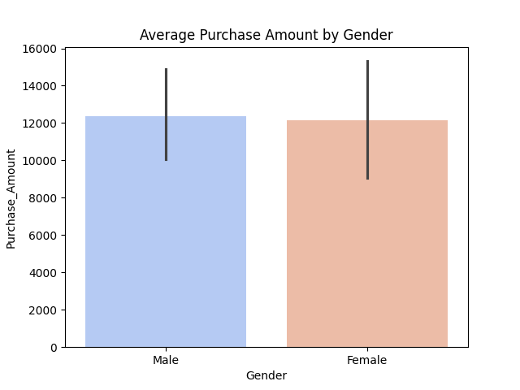
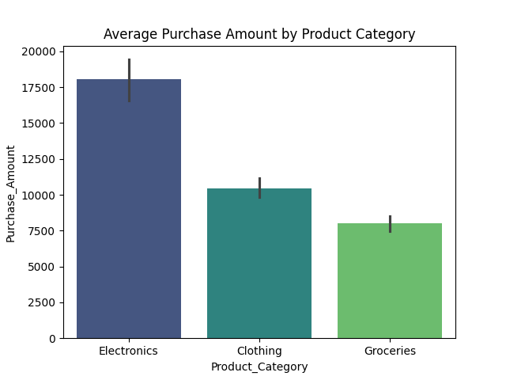
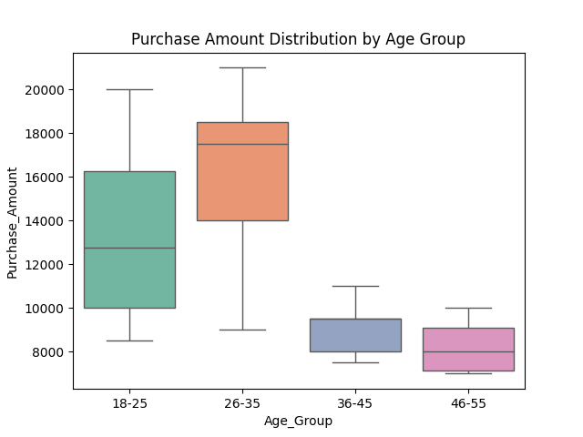
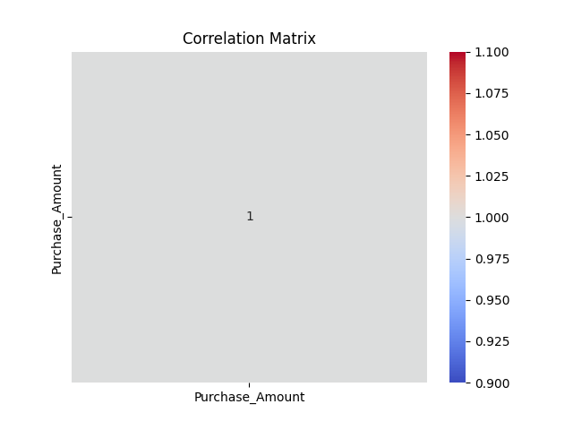

# 🛍️ Customer Purchase Data Analysis using Python (Pandas, Matplotlib & Seaborn)

This project analyzes **customer purchase behavior** based on demographics and spending patterns.
It uses Python libraries — **Pandas, Matplotlib, and Seaborn** — to visualize trends, averages, and correlations in purchase data.


## 🧠 Project Overview

The goal of this project is to:

* Analyze average purchase amounts by gender and product category
* Understand the relationship between age, gender, and spending
* Visualize purchase distribution and correlations between variables
* Strengthen Python and data visualization skills for data analysis projects

---

## 🗂️ Project Structure

📂 Customer-Purchase-Analysis
 ┣ 📜 main.py                     # Python script with code
 ┣ 📊 gender_purchase.png         # Bar plot (Average purchase by gender)
 ┣ 📊 category_purchase.png       # Bar plot (Average purchase by category)
 ┣ 📊 purchase_distribution.png   # Histogram of purchase amounts
 ┣ 📊 correlation_matrix.png      # Heatmap (Correlation of numeric fields)
 ┗ 📘 README.md                   # Project documentation


## 🧩 Libraries Used

| Library        | Purpose                                       |
| -------------- | --------------------------------------------- |
| **pandas**     | For data creation and manipulation            |
| **matplotlib** | For creating visual plots                     |
| **seaborn**    | For advanced and aesthetic data visualization |

Install them using:

pip install pandas matplotlib seaborn


## 📈 Visualizations

### 1️⃣ Average Purchase by Gender



### 2️⃣ Average Purchase by Product Category



### 3️⃣ Purchase Amount Distribution



### 4️⃣ Correlation Matrix




## 🚀 How to Run the Project

1. Clone this repository

   ```bash
   git clone https://github.com/<ishalangehh-wq>/customer-purchase-analysis.git
   ```

2. Open the project folder in **VS Code / Jupyter Notebook**

3. Run the script

   python main.py
   

4. View generated plots inside your project directory or output window.


## 💡 Insights

* **Male vs Female**: One gender may show higher average purchase amount
* **Product Categories**: Certain categories attract higher spending
* **Correlations**: Positive correlation between age and purchase amount indicates older customers spend more
* Data visualization helps reveal hidden spending trends and patterns


## 👩‍💻 Author

**Isha Langeh**
*Aspiring Data Analyst | Python | Pandas | Seaborn | Matplotlib*
🌐 [GitHub Profile](https://github.com/ishalangehh-wq)

 
                                                                                                                                                           
